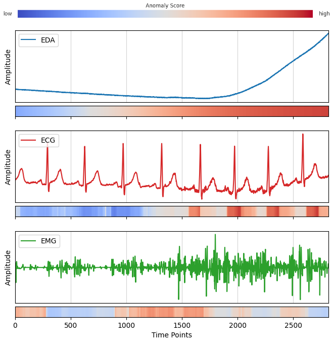
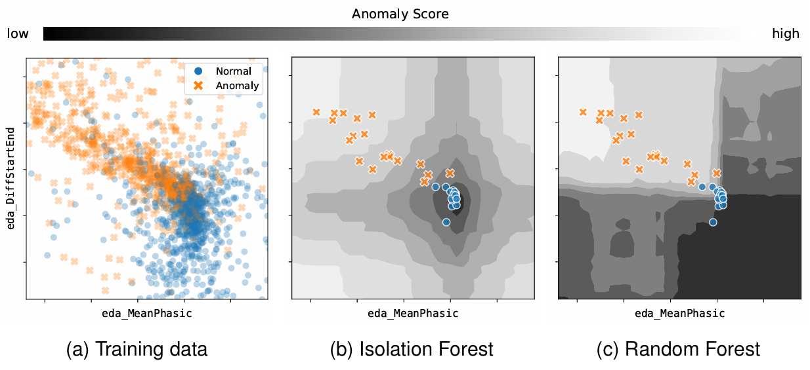
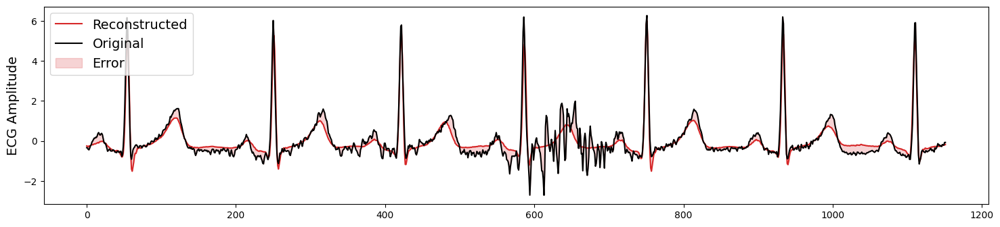

#  Methods of Anomaly Detection for Pain Recognition in Biophysiological Time Series

> **Abstract.** Traditional pain assessment methods rely on subjective self-report, which may be impractical or inaccurate in various scenarios. Consequently, methods for objective and automated pain assessment have become an active area of research. This study evaluates unsupervised anomaly detection (AD) methods for pain recognition in biophysiological time series using data from the BioVid Heat Pain Database (BVDB) Part A. Unlike conventional supervised classification approaches, the AD methods explored here are trained exclusively on normal (no pain) data. Three widely used AD methods– Matrix Profile, Isolation Forest, and Autoencoder– are evaluated for their effectiveness in detecting pain-related anomalies in electrodermal activity (EDA), electrocardiogram (ECG), and electromyogram (EMG) signals. These AD methods are also compared against simple baseline AD approaches, PolyFit and ArgMax, and a supervised random forest classifier.
>
> The results reveal that EDA is the simplest and most informative signal, achieving an area under the curve (AUC) of 88.05% with Isolation Forest and 87.92% with PolyFit. Interestingly, the simplest approach, ArgMax, which uses the position of the maximum value in the EDA signal as the anomaly score, achieved the highest accuracy of 82.61%. ECG and EMG signals were less effective individually, with their best accuracies reaching 72.62% and 58.23%, respectively, using Matrix Profile. These results suggest that AD methods offer a viable alternative to supervised classification methods for pain detection in scenarios where labeled data is unavailable or when the detection of novel anomalies beyond pain-related events is of interest.

This is my bachelor's thesis project, which I completed in 2024. Full report: [BVDB_anomaly_detection.pdf](BVDB_anomaly_detection.pdf)

## Methods
The following are the main methods used in this study:
- Matrix Profile
- Isolation Forest
- Autoencoder

## Dataset
Part A from the [BioVid Heat Pain Database](https://www.nit.ovgu.de/BioVid.html) is used in this study.

## Visualizations

*Figure 1: Anomalous segments are highlighted in red using the Matrix Profile method.*

---

*Figure 2: Isolation Forest decision boundaries (b), trained on normal samples only. Random Forest decision boundaries (c), trained on both classes.*

---

*Figure 3: Example of ECG signal reconstruction using an Autoencoder.*